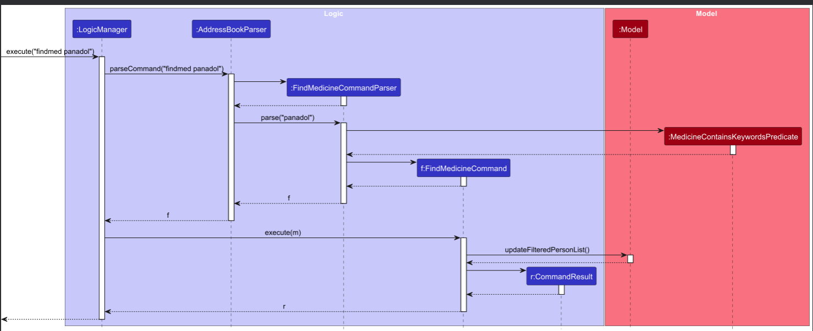

* Table of Contents
{:toc}

--------------------------------------------------------------------------------------------------------------------

## **Acknowledgements**

* CLInic is based on the AddressBook-Level3 (AB3) project created by the [SE-EDU](https://se-education.org/) initiative.
* Hence, both the User Guide and the Developer Guide were directly adapted from the original AB3 project.
* [AB3 User Guide](https://se-education.org/addressbook-level3/UserGuide.html)
* [AB3 Developer Guide](https://se-education.org/addressbook-level3/DeveloperGuide.html)

--------------------------------------------------------------------------------------------------------------------

## **Setting up, getting started**

Refer to the guide [_Setting up and getting started_](SettingUp.md).

--------------------------------------------------------------------------------------------------------------------

## **Design**

:bulb: **Tip:** The `.puml` files used to create diagrams are in this document `docs/diagrams` folder. Refer to the [_PlantUML Tutorial_ at se-edu/guides](https://se-education.org/guides/tutorials/plantUml.html) to learn how to create and edit diagrams.

### Architecture

The ***Architecture Diagram*** given above explains the high-level design of the App.

Given below is a quick overview of main components and how they interact with each other.

**Main components of the architecture**

**`Main`** (consisting of classes [`Main`](https://github.com/se-edu/addressbook-level3/tree/master/src/main/java/seedu/address/Main.java) and [`MainApp`](https://github.com/se-edu/addressbook-level3/tree/master/src/main/java/seedu/address/MainApp.java)) is in charge of the app launch and shut down.
* At app launch, it initializes the other components in the correct sequence, and connects them up with each other.
* At shut down, it shuts down the other components and invokes cleanup methods where necessary.

The bulk of the app's work is done by the following four components:

* [**`UI`**](#ui-component): The UI of the App.
* [**`Logic`**](#logic-component): The command executor.
* [**`Model`**](#model-component): Holds the data of the App in memory.
* [**`Storage`**](#storage-component): Reads data from, and writes data to, the hard disk.

[**`Commons`**](#common-classes) represents a collection of classes used by multiple other components.

**How the architecture components interact with each other**

The *Sequence Diagram* below shows how the components interact with each other for the scenario where the user issues the command `delete 1`.

Each of the four main components (also shown in the diagram above),

* defines its *API* in an `interface` with the same name as the Component.
* implements its functionality using a concrete `{Component Name}Manager` class (which follows the corresponding API `interface` mentioned in the previous point.

For example, the `Logic` component defines its API in the `Logic.java` interface and implements its functionality using the `LogicManager.java` class which follows the `Logic` interface. Other components interact with a given component through its interface rather than the concrete class (reason: to prevent outside component's being coupled to the implementation of a component), as illustrated in the (partial) class diagram below.

The sections below give more details of each component.

### UI component

The **API** of this component is specified in [`Ui.java`](https://github.com/AY2526S1-CS2103T-F12-4/tp/blob/master/src/main/java/seedu/address/ui/Ui.java)

The UI consists of a `MainWindow` that is made up of parts e.g.`CommandBox`, `ResultDisplay`, `PersonListPanel`, `StatusBarFooter` etc. All these, including the `MainWindow`, inherit from the abstract `UiPart` class which captures the commonalities between classes that represent parts of the visible GUI.

The `UI` component uses the JavaFx UI framework. The layout of these UI parts are defined in matching `.fxml` files that are in the `src/main/resources/view` folder. For example, the layout of the [`MainWindow`](https://github.com/se-edu/addressbook-level3/tree/master/src/main/java/seedu/address/ui/MainWindow.java) is specified in [`MainWindow.fxml`](https://github.com/se-edu/addressbook-level3/tree/master/src/main/resources/view/MainWindow.fxml)

The `UI` component,

* executes user commands using the `Logic` component.
* listens for changes to `Model` data so that the UI can be updated with the modified data.
* keeps a reference to the `Logic` component, because the `UI` relies on the `Logic` to execute commands.
* depends on some classes in the `Model` component, as it displays `Person` object residing in the `Model`.

### Logic component

**API** : [`Logic.java`](https://github.com/AY2526S1-CS2103T-F12-4/tp/blob/master/src/main/java/seedu/address/logic/Logic.java)

Here's a (partial) class diagram of the `Logic` component:

The sequence diagram below illustrates the interactions within the `Logic` component, taking `execute("delete 1")` API call as an example.

:information_source: **Note:** The lifeline for `DeleteCommandParser` should end at the destroy marker (X) but due to a limitation of PlantUML, the lifeline continues till the end of diagram.

How the `Logic` component works:

1. When `Logic` is called upon to execute a command, it is passed to an `AddressBookParser` object which in turn creates a parser that matches the command (e.g., `DeleteCommandParser`) and uses it to parse the command.
1. This results in a `Command` object (more precisely, an object of one of its subclasses e.g., `DeleteCommand`) which is executed by the `LogicManager`.
1. The command can communicate with the `Model` when it is executed (e.g. to delete a person). 
   Note that although this is shown as a single step in the diagram above (for simplicity), in the code it can take several interactions (between the command object and the `Model`) to achieve.
1. The result of the command execution is encapsulated as a `CommandResult` object which is returned back from `Logic`.

Here are the other classes in `Logic` (omitted from the class diagram above) that are used for parsing a user command:

How the parsing works:
* When called upon to parse a user command, the `AddressBookParser` class creates an `XYZCommandParser` (`XYZ` is a placeholder for the specific command name e.g., `AddCommandParser`) which uses the other classes shown above to parse the user command and create a `XYZCommand` object (e.g., `AddCommand`) which the `AddressBookParser` returns back as a `Command` object.
* All `XYZCommandParser` classes (e.g., `AddCommandParser`, `DeleteCommandParser`, ...) inherit from the `Parser` interface so that they can be treated similarly where possible e.g, during testing.

### Model component
**API** : [`Model.java`](https://github.com/AY2526S1-CS2103T-F12-4/tp/blob/master/src/main/java/seedu/address/model/Model.java)

The `Model` component,

* stores the address book data i.e., all `Person` objects (which are contained in a `UniquePersonList` object).
* stores the currently 'selected' `Person` objects (e.g., results of a search query) as a separate _filtered_ list which is exposed to outsiders as an unmodifiable `ObservableList<Person>` that can be 'observed' e.g. the UI can be bound to this list so that the UI automatically updates when the data in the list change.
* stores a `UserPref` object that represents the user’s preferences. This is exposed to the outside as a `ReadOnlyUserPref` objects.
* does not depend on any of the other three components (as the `Model` represents data entities of the domain, they should make sense on their own without depending on other components)

:information_source: **Note:** An alternative (arguably, a more OOP) model is given below. It has a `Tag` list in the `AddressBook`, which `Person` references. This allows `AddressBook` to only require one `Tag` object per unique tag, instead of each `Person` needing their own `Tag` objects. 

### Storage component

**API** : [`Storage.java`](https://github.com/AY2526S1-CS2103T-F12-4/tp/blob/master/src/main/java/seedu/address/storage/Storage.java)

The `Storage` component,
* can save both address book data and user preference data in JSON format, and read them back into corresponding objects.
* inherits from both `AddressBookStorage` and `UserPrefStorage`, which means it can be treated as either one (if only the functionality of only one is needed).
* depends on some classes in the `Model` component (because the `Storage` component's job is to save/retrieve objects that belong to the `Model`)

### Common classes

Classes used by multiple components are in the `seedu.address.commons` package.

--------------------------------------------------------------------------------------------------------------------

## **Implementation**

This section describes some noteworthy details on how certain features are implemented.

### findmed feature

The findmed feature is implemented by using the following classes:

#### Parser Class
* `FindMedicineCommandParser`
    * Parses multiple `med/` prefixes to extract medicine keywords (e.g., `findmed med/Paracetamol med/Ibuprofen`).
    * Handles the special `none` keyword to find patients with no medicines.
    * Validates that at least one medicine keyword is provided (unless `none` is specified).
    * Creates a `MedicineContainsKeywordsPredicate` with the extracted keywords and wraps it in a `FindMedicineCommand`.
#### Model Classes
* `Medicine`
    * This class abstracts a medicine by storing its name, validation regex, and message constraints.
    * Medicine names must not contain forward slashes (`/`) due to command parsing requirements.
* `MedicineContainsKeywordsPredicate`
    * This class implements `Predicate<Person>` and is used to filter the person list.
    * The `test()` method checks if any of the patient's medicines match any of the specified keywords (case-insensitive).
    * Uses OR logic: a patient matches if any of their medicines contain any of the keywords.
    * Special handling for `none` keyword: when keywords list is empty, matches patients with no medicines.

#### Command Class
* `FindMedicineCommand`
    * This class contains the execute method that facilitates the update of the list of patients
      that needs to be displayed and outputs a `CommandResult` object.

#### Sequence Diagram
The following sequence diagram explains how a `findmed` operation goes through the Logic and Model components.

**How `findmed` works:**
1. User enters command like `findmed med/Paracetamol med/Ibuprofen`.
2. `AddressBookParser` identifies the command and creates `FindMedicineCommandParser`.
3. `FindMedicineCommandParser` extracts all `med/` prefixes and creates `MedicineContainsKeywordsPredicate`.
4. `FindMedicineCommand` is created with the predicate.
5. `FindMedicineCommand.execute()` calls `model.updateFilteredPersonList(predicate)`.
6. The predicate filters patients whose medicines contain any of the keywords (case-insensitive OR logic).
7. Filtered list is displayed to the user.

Design Considerations:

* Alternative 1 (current Choice): `findmed` and other find-related commands filter from the list of all patients
  everytime someone performs the operation.
    * Pros: Easier to implement.
    * Cons: Cannot filter from an already filtered list of patients, making it
      more difficult to narrow down patients based on multiple filters. (e.g. Cannot filter by name "john" first,
      then further filter based on a medicine on the patients containing the name "john").

* Alternative 2 : `findmed` and other find-related commands filter based on the current state of the list displayed to
  the user.
    * Pros: Can Narrow down patients based on several filters applied one after the other.
    * Cons: Harder to implement, need to perform `list` operation to list all patients, before you want to filter from
      all patients stored.

### Visit logging feature

The visit logging feature allows clinic managers to track when patients visit the clinic. This feature is implemented using the following classes:

#### Model Classes
* `Person`
    * Contains a `DayList` object that stores a list of visit dates (`LocalDate` objects).
    * Provides `getDayList()` method to retrieve the DayList.
    * The Person class is immutable; visit dates are added by creating a new Person instance.
* `DayList`
    * Stores a sorted list of visit dates (`List<LocalDate>`) for a patient.
    * **Immutable design**: Operations like `addVisitDate()` return a new `DayList` instance rather than modifying the existing one.
    * Ensures no duplicate visits on the same day using `hasVisitDate()` check.
    * Automatically sorts visit dates chronologically.
    * Provides methods:
      * `addVisitDate(LocalDate date)`: Returns new DayList with date added (if not duplicate).
      * `hasVisitDate(LocalDate date)`: Checks if a date exists in the list.
      * `getVisitDates()`: Returns immutable view of all visit dates.
      * `getVisitCount()`: Returns number of visits.
      * `getMostRecentVisit()`: Returns most recent visit date (or null).
      * `getEarliestVisit()`: Returns earliest visit date (or null).

#### Command Classes
* `LogCommand`
    * Adds today's date (`LocalDate.now()`) to the patient's visit list.
    * Retrieves patient from filtered list using index.
    * Validates that the visit has not already been logged for today using `dayList.hasVisitDate(today)`.
    * Throws `CommandException` with message `MESSAGE_ALREADY_LOGGED_TODAY` if duplicate.
    * Creates a new `Person` instance with updated `DayList` (immutability pattern).
    * Uses `model.setPerson(target, updated)` to update the model.
    * Returns success message formatted with patient details.

* `DisplayCommand`
    * Displays all recorded visit dates for a specified patient.
    * Formats dates as "MMM dd, yyyy" using `DateTimeFormatter`.
    * Each date is prefixed with a bullet point ("• ").
    * Dates are joined with newlines for display.
    * Shows `MESSAGE_NO_VISITS` if `getVisitCount() == 0`.

#### Sequence Diagram
The following sequence diagram explains how `log` and `display` operations go through the Logic and Model components.

The diagram shows:
1. `AddressBookParser` creating `LogCommandParser` or `DisplayCommandParser`
2. The parser parsing the index and creating `LogCommand` or `DisplayCommand`
3. `LogCommand.execute()` calling `model.getFilteredPersonList()`
4. `LogCommand` checking `person.getDayList().hasVisitDate(today)`
5. `LogCommand` creating new `Person` with `dayList.addVisitDate(today)`
6. `LogCommand` calling `model.setPerson(target, updated)`
7. `DisplayCommand` retrieving visit dates and formatting them for display

**How `log` works:**
1. User enters `log INDEX`.
2. `AddressBookParser` creates `LogCommandParser` which parses the index.
3. `LogCommand` is created with the target index.
4. `LogCommand.execute()` retrieves the patient from the filtered list.
5. Checks if today's date already exists using `dayList.hasVisitDate(LocalDate.now())`.
6. If duplicate, throws `CommandException` with appropriate message.
7. Otherwise, creates a new `Person` with updated `DayList` using `dayList.addVisitDate(today)`.
8. Updates the model using `model.setPerson(personToLog, updatedPerson)`.
9. Returns success message.

Design Considerations:

* **Alternative 1 (current Choice)**: Visit logging uses `LocalDate.now()` to automatically log today's date.
    * Pros: Simple and prevents user errors in date entry.
    * Cons: Cannot log visits for past dates, which may be needed for historical data entry.

* **Alternative 2**: Allow users to specify a date for visit logging.
    * Pros: More flexible, allows logging historical visits.
    * Cons: More complex validation, potential for user errors in date entry.

* **Automatic Visit Logging on Patient Addition**: When a new patient is added via `AddCommand`, the `AddCommandParser` automatically creates a `DayList` with today's date: `new DayList().addVisitDate(LocalDate.now())`.
    * Pros: Ensures every patient has at least one visit record, simplifying visit tracking logic.
    * Cons: May not accurately reflect the actual first visit date if the patient was added after their first visit. Users cannot specify a different first visit date during patient creation.

--------------------------------------------------------------------------------------------------------------------

## **Documentation, logging, testing, configuration, dev-ops**

* [Documentation guide](Documentation.md)
* [Testing guide](Testing.md)
* [Logging guide](Logging.md)
* [Configuration guide](Configuration.md)
* [DevOps guide](DevOps.md)

--------------------------------------------------------------------------------------------------------------------

## **Appendix: Requirements**

### Product scope

**Target user profile**:

* has a need to manage a significant number of patient records in a clinic setting
* prefer desktop apps over other types for data security and offline access
* can type fast for efficient data entry
* prefers typing to mouse interactions for speed
* is reasonably comfortable using CLI apps
* needs to track medical information, medicines, and patient visits
* requires quick access to patient contact details for communication
* needs to manage patient medication

**Value proposition**: manage clinic operations and patient records faster than a typical mouse/GUI driven app, with specialized features for healthcare management

### User stories

Priorities: High (must have) - `* * *`, Medium (nice to have) - `* *`, Low (unlikely to have) - `*`

| Priority | As a …​                                    | I want to …​                     | So that I can…​                                                        |
| -------- | ------------------------------------------ | ------------------------------ | ---------------------------------------------------------------------- |
| `* * *`  | clinic manager                             | see usage instructions         | refer to instructions when I forget how to use the App                 |
| `* * *`  | clinic manager                             | add a new patient              | maintain up-to-date patient records                                    |
| `* * *`  | clinic manager                             | delete a patient               | remove entries that are no longer needed                               |
| `* * *`  | clinic manager                             | find a patient by name         | locate patient details without having to go through the entire list    |
| `* * *`  | clinic manager                             | view patient addresses         | deliver medicines to patients                                          |
| `* * *`  | clinic manager                             | view patient contact details   | contact patients when needed                                           |
| `* * *`  | clinic manager                             | log patient visits             | record when a patient visits the clinic for tracking purposes          |
| `* * *`  | clinic manager                             | view patient visit history     | see all visit dates for a specific patient to track their visit frequency |
| `* * *`  | clinic manager                             | view medicine distribution     | track which patients are taking which medicines                        |
| `* * *`  | clinic manager                             | edit patient records           | update information when changes are required                           |
| `* * *`  | clinic manager                             | record patient allergies       | avoid prescribing medicines that may cause adverse reactions           |
| `* * *`  | clinic manager                             | assign patient categories      | tailor communication and services (chronic illness, elderly, children) |
| `* * *`  | clinic manager                             | archive inactive patients      | keep active patient list uncluttered                                   |
| `* * *`  | clinic manager                             | apply batch actions            | update many patient records in one shot (tag, assign doctor, delete)   |
| `* * *`  | fast-typing user                          | use keyboard shortcuts         | work without touching the mouse                                        |
| `* * *`  | fast-typing user                          | use command history            | quickly repeat previous commands                                       |
| `* * *`  | fast-typing user                          | use custom command aliases     | streamline my workflow                                                 |
| `* * *`  | clinic manager                             | perform fuzzy search           | find patients even with partial or incorrect information               |
| `* *`    | clinic manager                             | hide private patient details   | minimize chance of someone else seeing sensitive information           |
| `* *`    | clinic manager                             | sort patients by name          | locate a patient easily in large lists                                 |
| `* *`    | clinic manager                             | filter patients by medicine    | see which patients are taking specific medications                     |
| `* *`    | clinic manager                             | filter patients by doctor      | prepare reports for specific doctors                                   |
| `* *`    | clinic manager                             | filter patients by location    | plan medicine deliveries in surrounding areas                          |
| `*`      | clinic manager                             | generate usage reports         | forecast future inventory needs                                        |
| `*`      | clinic manager                             | export patient data            | share reports with external stakeholders                               |
| `*`      | clinic manager                             | import patient records         | avoid retyping existing data from spreadsheets                         |
| `*`      | clinic manager                             | detect duplicate records       | maintain clean and consistent data                                     |

### Use cases

(For all use cases below, the **System** is `CLInic` and the **Actor** is the `clinic manager`, unless specified otherwise)

**Use case: UC01 - Add a new patient**

**MSS**

1. Clinic manager chooses to add a new patient.
2. Clinic manager enters the required patient information.
3. CLInic adds the patient and displays confirmation.
4. CLInic displays the updated patient list.

   Use case ends.

**Extensions**

* 2a. The patient information has invalid format.

  * 2a1. CLInic shows an error message.

    Use case resumes at step 2.

* 2b. The patient already exists in the system.

  * 2b1. CLInic shows an error message.

    Use case ends.

**Use case: UC02 - Find patients by name**

**MSS**

1. Clinic manager chooses to find patients by name.
2. Clinic manager enters one or more search keywords.
3. CLInic displays list of matching patients.

   Use case ends.

**Extensions**

* 2a. The search keywords are empty.

  * 2a1. CLInic shows an error message.

    Use case resumes at step 2.

* 3a. No patients match the search keywords.

  * 3a1. CLInic indicates that no patients match the search criteria.

    Use case ends.

**Use case: UC03 - View patient medicines**

**MSS**

1. Clinic manager chooses to view a patient's medicines.
2. Clinic manager enters the patient index.
3. CLInic displays the patient's medicines.

   Use case ends.

**Extensions**

* 2a. The index is invalid.

  * 2a1. CLInic shows an error message.

    Use case resumes at step 2.

* 3a. The patient has no medicines.

  * 3a1. CLInic indicates that the patient has no medicines recorded.

    Use case ends.

**Use case: UC04 - Edit patient information**

**MSS**

1. Clinic manager chooses to edit a patient.
2. Clinic manager enters the patient index and the fields to modify.
3. CLInic updates the patient information and displays confirmation.
4. CLInic displays the updated patient list.

   Use case ends.

**Extensions**

* 2a. The index is invalid.

  * 2a1. CLInic shows an error message.

    Use case resumes at step 2.

* 2b. The patient information has invalid format.

  * 2b1. CLInic shows an error message.

    Use case resumes at step 2.

* 2c. The edited patient would be identical to another existing patient.

  * 2c1. CLInic shows an error message.

    Use case resumes at step 2.

**Use case: UC05 - Find patients by doctor**

**MSS**

1. Clinic manager chooses to find patients by doctor.
2. Clinic manager enters one or more search keywords.
3. CLInic displays list of matching patients.

   Use case ends.

**Extensions**

* 2a. The search keywords are empty.

  * 2a1. CLInic shows an error message.
  
    Use case resumes at step 2.

* 3a. No patients match the search keywords.

  * 3a1. CLInic indicates that no patients match the search criteria.
  
    Use case ends.

**Use case: UC06 - Find patients by medicine**

**MSS**

1. Clinic manager chooses to find patients by medicine.
2. Clinic manager enters one or more search keywords (or `none`).
3. CLInic displays list of matching patients.

   Use case ends.

**Extensions**

* 2a. The search keywords are empty.

  * 2a1. CLInic shows an error message.
  
    Use case resumes at step 2.

* 3a. No patients match the search keywords.

  * 3a1. CLInic indicates that no patients match the search criteria.
  
    Use case ends.

**Use case: UC07 - Delete a patient**

**MSS**

1. Clinic manager chooses to delete a patient.
2. Clinic manager enters the patient index.
3. CLInic removes the patient and displays confirmation.
4. CLInic displays the updated patient list.

   Use case ends.

**Extensions**

* 2a. The index is invalid.

  * 2a1. CLInic shows an error message.

    Use case resumes at step 2.

**Use case: UC08 - View a patient**

**MSS**

1. Clinic manager chooses to view a patient.
2. Clinic manager enters the patient index.
3. CLInic displays information about that patient.

   Use case ends.

**Extensions**

* 2a. The index is invalid.

  * 2a1. CLInic shows an error message.

    Use case resumes at step 2.

**Use case: UC09 - List all patients**

**MSS**

1. Clinic manager chooses to list all patients.
2. CLInic displays list of all patients.

   Use case ends.

**Extensions**

* 2a. There are no patients in the system.

  * 2a1. CLInic displays an empty list.
  
    Use case ends.

**Use case: UC10 - Log a visit**

**MSS**

1. Clinic manager chooses to log a visit for a patient.
2. Clinic manager enters the patient index.
3. CLInic logs today's date for the patient and displays confirmation.

  Use case ends.

**Extensions**

* 2a. The index is invalid.

  * 2a1. CLInic shows an error message.

    Use case resumes at step 2.

* 3a. A visit for today is already recorded for the patient.

  * 3a1. CLInic indicates that today's visit has already been logged.

    Use case ends.

**Use case: UC11 - Display visit dates**

**MSS**

1. Clinic manager chooses to display a patient's visit dates.
2. Clinic manager enters the patient index.
3. CLInic displays recorded visit dates for the patient.

   Use case ends.

**Extensions**

* 2a. The index is invalid.

  * 2a1. CLInic shows an error message.

    Use case resumes at step 2.

* 3a. The patient has no recorded dates.

  * 3a1. CLInic indicates that the patient has no recorded dates.

    Use case ends.

**Use case: UC12 - Clear all entries**

**MSS**

1. Clinic manager chooses to clear all patient entries.
2. CLInic clears all patient data and displays confirmation.

   Use case ends.

**Use case: UC13 - Viewing help**

**MSS**

1. Clinic manager chooses to view help.
2. CLInic displays the help URL.

  Use case ends.

### Non-Functional Requirements

1. **Platform Independence**: Should work on any _mainstream OS_ as long as it has Java `17` installed.

2. **Performance**: Should be able to hold up to 1000 patients without a noticeable sluggishness in performance for typical usage.

3. **Usability**: A user with above average typing speed for regular English text (i.e. not code, not system admin commands) should be able to accomplish most of the tasks faster using commands than using the mouse.

4. **Data Security**: Patient medical information should be stored locally and not transmitted over the network to ensure privacy and compliance with healthcare data protection requirements.

5. **Reliability**: The system should maintain data integrity even if the application crashes unexpectedly, with automatic saving of patient records.

6. **Scalability**: The system should handle growth from small clinics (50-100 patients) to medium-sized clinics (500-1000 patients) without significant performance degradation.

7. **Accessibility**: The system should be usable by healthcare professionals with average to fast typing speeds, with clear error messages and help documentation.

8. **Response Time**: Common operations (add patient, search patient, view details) should complete within 2 seconds for typical usage scenarios.

9. **Backup and Recovery**: The system should support data backup and recovery mechanisms to prevent loss of critical patient information.

10. **Offline Functionality**: The system should work completely offline (except the help link to our user guide) to ensure availability in areas with poor internet connectivity.

11. **Memory Usage**: The system should not consume excessive memory resources (not more than 200 MB), suitable for typical clinic computer systems.

### Glossary
* **Mainstream OS**: Examples include Windows, Linux, Unix and macOS.

* **CLI (Command Line Interface)**: A text-based interface where users type commands into the command box to control CLInic.

* **GUI (Graphical User Interface)**: The visual interface (windows, buttons, lists) rendered by JavaFX that displays data and receives user input.

* **JSON**: A human-readable text format used by the app to store data files on disk.

* **UI**: The component that renders the graphical interface using JavaFX and forwards user input to the `Logic` layer.

* **Logic**: The component that executes Commands and coordinates model updates and responses to the UI.

* **Storage**: The component responsible for persisting and loading application data as JSON files on disk.

* **AddressBookParser**: The component that converts raw command strings into `Command` objects by delegating to specific command parsers.

* **Parser (interface)**: The interface implemented by `XYZCommandParser` classes to parse command syntax into `Command` instances.

* **ParserUtil**: A collection of small helper methods used by parsers to validate and convert raw input into model values.

* **Command**: An object representing an executable user action, created by parsers and run by the `Logic` component.

* **CommandResult**: The object returned after executing a `Command` carrying the message to display and any UI hints.

* **Model**: The layer that exposes data and operations on the AddressBook and user preferences to other components.

* **AddressBook**: The in-memory container holding all `Person` objects representing patient data.

* **VersionedAddressBook**: A model wrapper that stores snapshots of AddressBook states to support undo and redo.

* **Batch Action**: An operation that applies a single command to multiple patients at once (for example, tagging several patients).

* **Fuzzy Search**: A search strategy that matches results approximately, such as case-insensitive or token-based matching.

* **Patient Record**: A patient's contact details and medications.

* **Patient Categories**: Tags used to classify patients (for example, chronic, elderly, child) for filtering or reporting.

* **Clinic Manager**: The primary user role responsible for managing patient records and clinic operations.

* **Healthcare Provider**: A doctor, nurse, or clinician assigned to care for a patient.

* **Private Patient Detail**: Sensitive patient information that must be protected and not disclosed.

* **Visit Schedule**: A log of dates when a patient visited the clinic.

* **Medicine Distribution**: Tracking which patients are prescribed or taking particular medications.

* **Inventory**: The stock of medicines and medical supplies that the clinic keeps on hand.

* **Command Alias**: A shortened or alternate name for an existing command.

--------------------------------------------------------------------------------------------------------------------

## **Appendix: Instructions for manual testing**

Given below are instructions to test the app manually.

:information_source: **Note:** These instructions only provide a starting point for testers to work on;
testers are expected to do more *exploratory* testing.

### Launch and shutdown

1. Initial launch

   1. Download the jar file and copy into an empty folder

   1. Double-click the jar file Expected: Shows the GUI with a set of sample contacts. The window size may not be optimum.

1. Saving window preferences

   1. Resize the window to an optimum size. Move the window to a different location. Close the window.

   1. Re-launch the app by double-clicking the jar file. 
       Expected: The most recent window size and location is retained.

### Deleting a person

1. Deleting a person while all persons are being shown

   1. Prerequisites: List all persons using the `list` command. Multiple persons in the list.

   1. Test case: `delete 1` 
      Expected: First contact is deleted from the list. Details of the deleted contact shown in the status message. Timestamp in the status bar is updated.

   1. Test case: `delete 0` 
      Expected: No person is deleted. Error details shown in the status message. Status bar remains the same.

   1. Other incorrect delete commands to try: `delete`, `delete x`, `...` (where x is larger than the list size) 
      Expected: Similar to previous.

### Adding a patient

1. Adding a patient with all fields

   1. Prerequisites: None.

   1. Test case: `add n/John Doe p/98765432 e/john@example.com a/123 Main Street dr/Dr. Smith t/diabetes med/Paracetamol` 
      Expected: Patient added with all fields. Details shown in the status message. Patient appears in the list.

   1. Test case: `add n/John Doe p/98765432 e/john@example.com a/123 Main Street` 
      Expected: Patient added with required fields only. Optional fields (doctor, tags, medicines) are omitted.

1. Adding a patient with invalid fields

   1. Test case: `add n/ p/98765432 e/john@example.com a/123 Main Street` 
      Expected: Error message shown. Patient is not added.

   1. Test case: `add n/John Doe p/12 e/john@example.com a/123 Main Street` 
      Expected: Error message about phone number being too short. Patient is not added.

### Finding patients

1. Finding patients by name

   1. Prerequisites: At least one patient in the list.

   1. Test case: `find John` 
      Expected: All patients with "John" in their name are displayed.

   1. Test case: `find John Doe` 
      Expected: Patients matching both "John" and "Doe" are displayed.

1. Finding patients by medicine

   1. Prerequisites: At least one patient with medicine recorded.

   1. Test case: `findmed med/Paracetamol` 
      Expected: All patients taking Paracetamol are displayed.

   1. Test case: `findmed none` 
      Expected: All patients with no medicines recorded are displayed.

### Logging visits

1. Logging a visit for a patient

   1. Prerequisites: At least one patient in the list.

   1. Test case: `log 1` 
      Expected: Today's date is logged for the first patient. Success message shown.

   1. Test case: `log 1` (repeated immediately) 
      Expected: Error message indicating visit has already been logged for today.

### Viewing patient information

1. Viewing patient details

   1. Prerequisites: At least one patient in the list.

   1. Test case: `view 1` 
      Expected: Full details of the first patient are displayed, including name, phone, email, address, doctor, tags, and medicines.

1. Viewing patient medicines

   1. Prerequisites: At least one patient in the list.

   1. Test case: `med 1` 
      Expected: All medicines for the first patient are displayed.

   1. Test case: `med 1` (for patient with no medicines) 
      Expected: Message indicating no medicines recorded.

--------------------------------------------------------------------------------------------------------------------

## **Appendix: Effort**

This section describes the difficulty level, challenges faced, effort required, and achievements of the CLInic project.

### Project Overview

CLInic is a desktop application for clinic management, built on top of the AddressBook-Level3 (AB3) framework. While AB3 dealt with a single entity type (Person), CLInic extends this to handle healthcare-specific features including patient records, medicine tracking, visit logging, and doctor assignments.

### Difficulty Level

**Moderate to High**: The project required significant extension of the AB3 framework, particularly in:

* **Multiple Entity Relationships**: Implementing medicine tracking, visit logging, and doctor assignments required careful design of relationships between entities.
* **Domain-Specific Validation**: Healthcare data requires stricter validation rules (e.g., medicine names, patient records, visit dates).
* **Enhanced Search Capabilities**: Implementing multiple search filters (by name, doctor, medicine) required predicate design and filtering logic.
* **UI Enhancements**: Adding command hints, conditional field display, and color-coded tags required UI component modifications.

### Challenges Faced

1. **Medicine Parsing**: The initial implementation had challenges with parsing multiple medicines from a single command (e.g., `add n/John med/Paracetamol med/Ibuprofen`), requiring careful handling of the `med/` prefix parsing using `ArgumentMultimap.getAllValues(PREFIX_MEDICINE)`. The parser needed to handle multiple occurrences of the same prefix while maintaining proper validation.

2. **Visit Date Management**: Implementing automatic visit logging on patient addition (in `AddCommandParser`) and preventing duplicate visits on the same day required:
   * Immutable `DayList` design with `addVisitDate()` returning new instances
   * Duplicate detection using `hasVisitDate(LocalDate)` checks
   * Proper integration with `Person` immutability pattern
   * Date formatting for display using `DateTimeFormatter`

3. **Command Hint System**: Creating a dynamic command hint system that provides context-aware suggestions required:
   * Real-time parsing of partial commands
   * Matching against command prefixes (case-insensitive)
   * UI integration with `CommandBox` and `CommandHint` components
   * Handling multiple matching commands (e.g., `find`, `finddoc`, `findmed`)

4. **Data Validation**: Ensuring all field constraints are properly validated:
   * Name: Allows alphanumeric, spaces, commas, at symbols, hyphens, and `s/o`/`d/o` patterns only
   * Phone: Minimum 3 digits, maximum 20 digits
   * Email: Complex regex validation for local-part@domain format
   * Medicine: No forward slashes allowed (parsing constraint)
   * Doctor: Same constraints as Name but optional
   * Tags: Alphanumeric and hyphens only
   * All fields have maximum length constraints defined in `CharacterLimit` class

5. **Case-Insensitive Duplicate Detection**: Implementing case-insensitive name checking for duplicate detection in `Person.isSamePerson()` using `equalsIgnoreCase()`, ensuring "John Doe" and "john doe" are treated as the same person.

### Effort Required

* **Team Size**: 5 members
* **Development Time**: Approximately 10 weeks (iterations v1.0 through v1.5)
* **Code Contribution**: Significant new code added across Logic, Model, UI, and Storage components

### Achievements

1. **Feature Completeness**: Successfully implemented all core features including patient management, medicine tracking, visit logging, and search capabilities.

2. **Code Quality**: Maintained high code quality standards with comprehensive test coverage, proper error handling, and clear documentation.

3. **User Experience**: Enhanced UI with command hints, color-coded tags, and conditional field display for better usability.

4. **Data Integrity**: Implemented robust validation and duplicate detection to ensure data consistency.

5. **Documentation**: Comprehensive User Guide and Developer Guide with clear instructions and examples.

### Comparison with AB3

While AB3 provided an excellent foundation, CLInic required substantial additional work:

* **AB3**: Single entity type (Person) with basic fields and simple search
* **CLInic**: Extended to include medicines (multiple per patient), visit tracking, doctor assignments, and multiple search filters

The complexity increase was primarily in:
- **Model relationships**: 
  * `Person` → `Set<Medicine>` (many-to-many relationship)
  * `Person` → `DayList` (one-to-one relationship with sorted list of `LocalDate`)
  * `Person` → `Doctor` (optional one-to-one relationship)
- **Search predicates**: 
  * `MedicineContainsKeywordsPredicate` (OR logic, case-insensitive, handles `none` keyword)
  * `DoctorNameContainsKeywordsPredicate` (similar pattern for doctor search, uses `StringUtil.containsWordIgnoreCase`)
  * `NameContainsKeywordsPredicate` (for name search, uses `StringUtil.containsWordIgnoreCase`)
- **Command parsing**: 
  * Handling multiple `med/` prefixes in `FindMedicineCommandParser`
  * Automatic visit date logging in `AddCommandParser` (`new DayList().addVisitDate(LocalDate.now())`)
  * Index-based patient selection with validation
- **UI enhancements**: 
  * Dynamic command hints with real-time parsing
  * Conditional field display (empty doctor field hidden)
  * Color-coded tags (allergy tags in red, general tags in blue, medicines in green)

### Reuse and Adaptation

* **AB3 Framework**: Reused architecture, component structure, and basic command pattern (~70% of base structure)
* **New Components**: Medicine, Visit tracking, enhanced search predicates, command hints (~30% new code)
* **Adaptation Work**: Significant customization of existing components to fit healthcare domain requirements

--------------------------------------------------------------------------------------------------------------------

## **Appendix: Planned Enhancements**

Team size: 5

1. **Support medicine names with slashes**: The current implementation does not allow medicine names that contain forward slashes (`/`), which is a limitation when recording medicines with dosage information (e.g., `Paracetamol/500mg`, `Co-codamol/30mg`). We plan to update the `Medicine` validation regex to allow forward slashes while maintaining proper parsing. This will involve modifying the `Medicine` class validation regex and updating the command parser to handle slashes correctly. Example: Users will be able to add medicines like `add n/John Doe med/Paracetamol/500mg` without errors.

2. **Improve UI display for long content**: The current UI may appear cut off on some displays, especially when result display, command box, or command hints contain long content. We plan to add automatic scrolling and proper text wrapping to ensure all content is visible and accessible. This will involve updating the `ResultDisplay`, `CommandBox`, and `CommandHint` components to handle overflow gracefully with scrollbars that appear when needed. The scrollbars will be visible by default when content exceeds the display area.

3. **Detailed offline help window**: When a user performs a `help` operation, currently only a URL to the user guide is displayed. We plan to add a pop-up window containing all command formats with examples, making it easier for users to access help without leaving the application. This will involve creating a new `HelpWindow` component that displays formatted command documentation.

4. **Unique identification numbers for patients**: Currently, patients are identified by name, which prevents adding patients with the same name (even if they are different people). We plan to assign each patient a unique identification number upon creation, allowing patients with the same name to coexist in the system. Patients will be distinguished by their unique ID, while names can still be used for searching and display. Example: `add n/John Doe` will create a patient with ID `P001`, and another `add n/John Doe` will create a patient with ID `P002`.

5. **Confirmation for delete and clear commands**: Currently, `delete` and `clear` commands execute immediately without confirmation, which can lead to accidental data loss. We plan to add a two-step confirmation process: first, display a warning message showing what will be deleted, then require the user to enter `yes` to proceed or `no` to cancel. Example: `delete 1` will show "Are you sure you want to delete patient at index 1? Type 'yes' to confirm or 'no' to cancel." Then the user must type `yes` or `no` to proceed.
