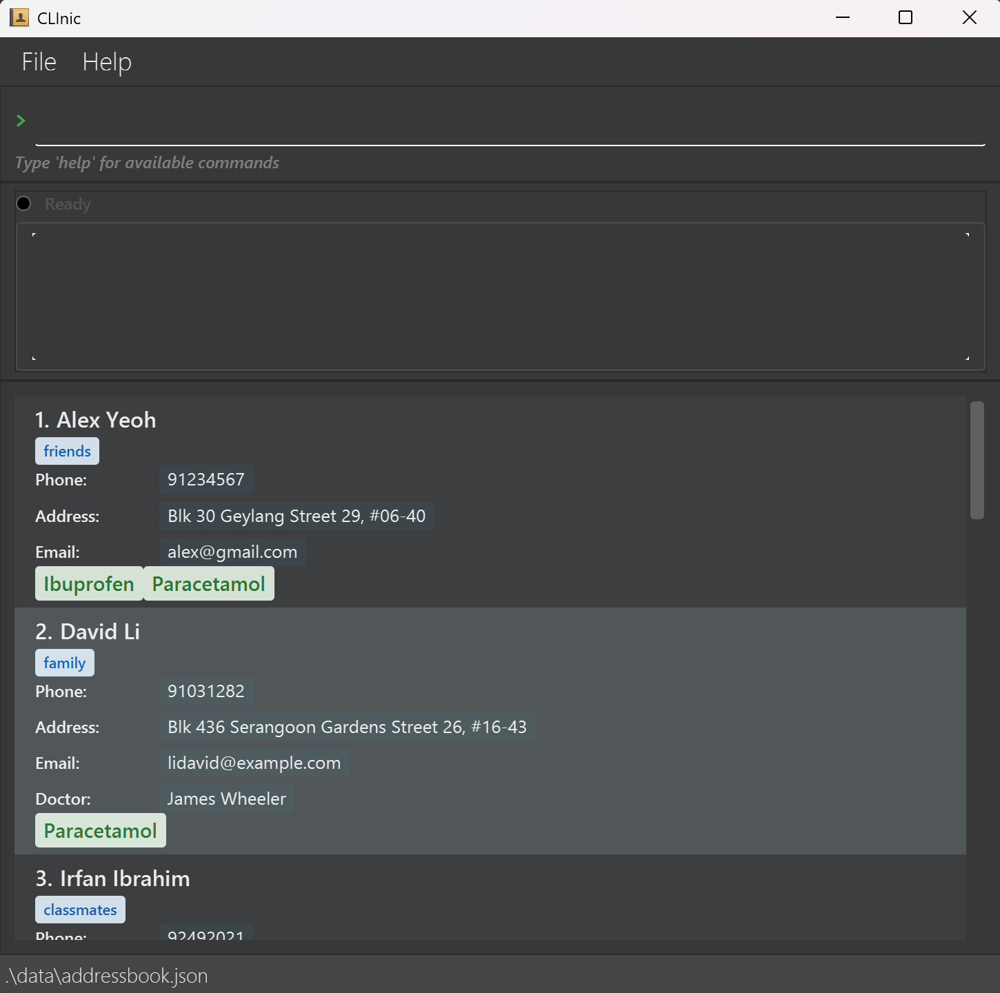

CLInic is a **desktop app designed for small clinic managers for managing patient data, optimized for use via a Command Line Interface** (CLI) while still having the benefits of a Graphical User Interface (GUI). It is primarily intended for clinic managers working at the front desk who need a fast, keyboard-driven way to manage patient records. If you can type fast, CLInic can get your patient management tasks done faster than traditional GUI apps.

What you can manage with CLInic:

* Patients: add new patients, view a full record, edit details, and delete when necessary (`add`, `view`, `edit`, `delete`, `list`).

* Visits: log a new visit and display a patient’s past visit dates for quick verification at the counter (`log`, `display`).

* Medications: see what medicines a patient is taking and find other patients on the same medication (`med`, `findmed`).

* Doctors & assignments: locate patients by their attending doctor to help with scheduling and triage (`finddoc`).

Search & retrieval: filter by name for rapid identification, even in large panels (`find`).
## Table of Contents
- [Quick start](#quick-start)
- [Features](#features)
    - [Viewing help : `help`](#viewing-help--help)
    - [Adding a patient : `add`](#adding-a-patient-add)
    - [Listing all patients : `list`](#listing-all-patients--list)
    - [Viewing a patient : `view`](#viewing-a-patient--view)
    - [Viewing medicines taken by patient : `med`](#viewing-medicines-taken-by-patient--med)
    - [Managing Visits](#managing-visits)
        - [Logging a visit for a patient : `log`](#logging-a-visit-for-a-patient--log)
        - [Displaying visit dates for a patient : `display`](#displaying-visit-dates-for-a-patient--display)
    - [Editing a patient : `edit`](#editing-a-patient--edit)
    - [Locating patients by name : `find`](#locating-patients-by-name-find)
    - [Locating patients by doctor's name : `finddoc`](#locating-patients-by-doctor-finddoc)
    - [Locating patients by medicines taken : `findmed`](#locating-patients-by-medicines-taken-findmed)
    - [Deleting a patient : `delete`](#deleting-a-patient--delete)
    - [Clearing all entries : `clear`](#clearing-all-entries--clear)
    - [Exiting the program : `exit`](#exiting-the-program--exit)
    - [Saving the data](#saving-the-data)
    - [Editing the data file](#editing-the-data-file)
- [FAQ](#faq)
- [Known issues](#known-issues)
- [Command summary](#command-summary)

--------------------------------------------------------------------------------------------------------------------

## Quick start

1. Ensure you have Java `17` installed on your computer. To confirm, open a terminal and run `java -version`; it should print a line containing `17` (for example: `java version "17.0.2"`). 
  **Mac users:** Ensure you have the precise JDK version prescribed [here](https://se-education.org/guides/tutorials/javaInstallationMac.html).

2. Download the latest `.jar` file from [here](https://github.com/AY2526S1-CS2103T-F12-4/tp/releases).

3. Copy the file to the folder you want to use as the _home folder_ for CLInic.

4. Open a command terminal, navigate (`cd`) into the folder you put the jar file in, and use the `java -jar CLInic.jar` command to run the application. 
   A GUI similar to the below should appear in a few seconds. Note how the app contains some sample data. 

   

5. Type the command in the command box and press Enter to execute it. e.g. typing **`help`** and pressing Enter will open the help window. 
   Some example commands you can try:

  * `list` : Lists all patients.

  * `add n/John Doe p/98765432 e/johnd@example.com a/John street, block 123, #01-01` : Adds a patient named `John Doe` to CLInic.

  * `delete 3` : Deletes the 3rd patient shown in the current list.

  * `clear` : Deletes all patients.

  * `exit` : Exits the app.

6. Refer to the [Features](#features) below for details of each command.

--------------------------------------------------------------------------------------------------------------------

## Features

**:information_source: Notes about the command format:** 

* Words in `UPPER_CASE` are the parameters to be supplied by the user. 
  e.g. in `add n/NAME`, `NAME` is a parameter which can be used as `add n/John Doe`.

* Items in square brackets are optional. 
  e.g `n/NAME [t/TAG]` can be used as `n/John Doe t/friend` or as `n/John Doe`.

* Items with `…`​ after them can be used multiple times including zero times. 
  e.g. `[t/TAG]…​` can be used as ` ` (i.e. 0 times), `t/friend`, `t/friend t/family` etc.

* Parameters can be in any order. 
  e.g. if the command specifies `n/NAME p/PHONE_NUMBER`, `p/PHONE_NUMBER n/NAME` is also acceptable.

* Extraneous parameters for commands that do not take in parameters (such as `help`, `list`, `exit` and `clear`) will be ignored. 
  e.g. if the command specifies `help 123`, it will be interpreted as `help`.

* If you are using a PDF version of this document, be careful when copying and pasting commands that span multiple lines as space characters surrounding line-breaks may be omitted when copied over to the application.

* **Command hints**: As you type commands, CLInic displays helpful hints below the command box. When you type a complete command word (e.g., `find`), the hint shows the full command format with parameters and examples for that specific command. When you type a partial command word that matches multiple commands (e.g., `fin`), the hint shows suggestions like "Possible commands: find, finddoc, findmed" to help you discover and complete your command. The hints persist as you continue typing parameters, helping you see the correct command format throughout.

**:information_source: Field constraints:** 

All fields in CLInic have specific validation rules to ensure data integrity. The following constraints apply to each field:

* **NAME**: 
  * Can contain alphanumeric characters, spaces, commas (`,`), at symbols (`@`), and hyphens (`-`)
  * The only slash-based patterns allowed are `s/o` and `d/o` (lowercase only). No other slashes are permitted
  * Cannot be blank
  * Maximum length: 100 characters
  * Cannot contain consecutive spaces
  * Examples: `John Doe`, `Mary-Anne`, `O'Connor`, `Dr. Smith`, `John s/o James`, `Sarah d/o David`, `John@Smith`, `John, Smith`
  * Invalid: `John/Jane` (slash not allowed except s/o or d/o), `John  Doe` (consecutive spaces), ` ` (blank)

* **PHONE_NUMBER**:
  * Must contain only digits (0-9)
  * Minimum length: 3 digits
  * Maximum length: 20 digits
  * Examples: `98765432`, `123`, `12345678901234567890` (20 digits)
  * Invalid: `12` (too short), `9876-5432` (contains hyphen), `+65 98765432` (contains plus and space), `123456789012345678901` (21 digits - exceeds maximum)

* **EMAIL**:
  * Must be of the format `local-part@domain`
  * The local-part should only contain alphanumeric characters and the following special characters: `+`, `_`, `.`, `-` (excluding parentheses)
  * The local-part may not start or end with any special characters
  * The domain name is made up of domain labels separated by periods (`.`)
  * The domain name must:
    - End with a domain label at least 2 characters long
    - Have each domain label start and end with alphanumeric characters
    - Have each domain label consist of alphanumeric characters, separated only by hyphens, if any
  * Maximum length: 100 characters
  * Examples: `john@example.com`, `alice.bob@test.co.uk`, `user_name+tag@domain-name.com`
  * Invalid: `@example.com` (missing local-part), `john@` (missing domain), `john@com` (domain label too short)

* **ADDRESS**:
  * Can take any values as long as it is not blank
  * Maximum length: 100 characters
  * Cannot contain consecutive spaces
  * Examples: `123 Main Street`, `Block 123, #01-01`, `Newgate Prison`
  * Invalid: ` ` (blank), `123  Main Street` (consecutive spaces)

* **DOCTOR**:
  * Can contain alphanumeric characters, spaces, commas (`,`), at symbols (`@`), and hyphens (`-`)
  * The only slash-based patterns allowed are `s/o` and `d/o` (lowercase only). No other slashes are permitted
  * Can be empty (optional field)
  * Maximum length: 100 characters
  * Examples: `Dr. Smith`, `Mary-Anne`, `John s/o James`, `Sarah d/o David`, `John@Smith`, `John, Smith`, ` ` (empty)
  * Invalid: `Dr./Smith` (slash not allowed except s/o or d/o)

* **MEDICINE**:
  * Can take any values except forward slashes (`/`)
  * Cannot be blank when adding a patient
  * Can be blank when editing a patient (to clear medicines)
  * Maximum length: 60 characters
  * Examples: `Paracetamol`, `Co-codamol`, `Aspirin-100mg`, `Vitamin D3`, `Any@#$%^&*()characters`
  * Invalid: `Paracetamol/500mg` (contains slash), ` ` (blank when adding)

* **TAG**:
  * Must contain only alphanumeric characters and hyphens (`-`)
  * Cannot be blank
  * Maximum length: 50 characters
  * Examples: `friend`, `allergy-peanut`, `diabetes`, `owesMoney`
  * Invalid: `friend_tag` (underscore not allowed), `friend tag` (space not allowed), ` ` (blank)

* **Duplicate Names**: CLInic does not allow duplicate patient names. Duplicate detection is case-insensitive, meaning "John Doe" and "john doe" are considered the same name and cannot both be added.

### Viewing help : `help`

Shows a message explaining how to access the help page.

Format: `help`

:information_source: **Tip:**
While typing commands, CLInic provides real-time command hints below the command box. These hints show the complete command format (including parameters and examples) when you type a complete command word, or suggest similar commands when you type a partial command word. This helps you discover commands and their correct syntax without needing to remember every detail.

### Adding a patient: `add`

Adds a patient to CLInic.

Format: `add n/NAME p/PHONE_NUMBER e/EMAIL a/ADDRESS [dr/DOCTOR] [t/TAG]…​ [med/MEDICINE]…​`

:information_source: **Note:**
When a new patient is added, the current date is automatically logged as their first visit.

:exclamation: **Important:**
CLInic does not allow duplicate patient names. If you try to add a patient with a name that already exists in the address book, you will receive an error message. Duplicate detection is case-insensitive, meaning "John Doe" and "john doe" are considered the same name and cannot both be added.

:bulb: **Tip:**
To create a red allergy tag, use `t/allergy` when adding a patient. Any tag containing the word "allergy" (case-insensitive) will appear red in the interface.

Tag names may use hyphens to separate words (e.g. `allergy-peanut`).
(Spaces and Underscores are not allowed).

Examples:
* `add n/John Doe p/98765432 e/johnd@example.com a/John street, block 123, #01-01 dr/James William`.
* `add n/Betsy Crowe t/friend e/betsycrowe@example.com a/Newgate Road p/1234567 t/friend med/Paracetamol med/Aspirin`.

### Listing all patients : `list`

Shows a list of all patients in CLInic. Each patient is displayed with an index number (1, 2, 3, ...) that can be used with other commands like `view`, `edit`, `delete`, `med`, `log`, and `display`.

Format: `list`

### Viewing a patient : `view`

Views the specified patient details from CLInic (includes name, phone, email, address, doctor, tags, and medicines).

Format: `view INDEX`

* Views the patient details at the specified `INDEX`.
* The index refers to the index number shown in the displayed patient list.
* The index **must be a positive integer** 1, 2, 3, …​

Examples:
* `list` followed by `view 3` views the 3rd patient in CLInic.
* `find Jackson` followed by `view 1` views the 1st patient in the results of the `find` command.

### Viewing medicines taken by patient : `med`

Views all medicines taken by the specified patient.

Format: `med INDEX`

* Views the medicines taken by the patient at the specified `INDEX`.
* The index refers to the index number shown in the displayed patient list.
* The index **must be a positive integer** 1, 2, 3, …​

Examples:
* `list` followed by `med 3` views the medicines taken by the 3rd patient in CLInic.
* `find Jackson` followed by `med 1` views the medicines taken by the 1st patient in the results of the `find` command.

## Managing Visits

CLInic allows you to track patient visits by logging visit dates. Each time a patient visits the clinic, you can record the visit date using the `log` command. You can also view all recorded visit dates for a patient using the `display` command. Visit dates are useful for tracking patient history and verifying visit frequency.

### Logging a visit for a patient : `log`

Logs today's date as a visit for the specified patient.

:information_source: **Note:**
When a new patient is added, the current date is automatically logged as their first visit.

Format: `log INDEX`

* Logs today's date as a visit for the patient at the specified `INDEX`.
* The index refers to the index number shown in the displayed patient list.
* The index **must be a positive integer** 1, 2, 3, …​
* The `log` command only logs today's date (the current date). It cannot be used to log visits for past or future dates.
* If a visit has already been logged for today, the command will fail with a message indicating it has already been logged.

Examples:
* `list` followed by `log 3` logs today's visit for the 3rd patient in CLInic.
* `find Jackson` followed by `log 1` logs today's visit for the 1st patient in the results of the `find` command.

### Displaying visit dates for a patient : `display`

Displays all recorded visit dates for the specified patient.

Format: `display INDEX`

* Displays the visit dates of the patient at the specified `INDEX`.
* The index refers to the index number shown in the displayed patient list.
* The index **must be a positive integer** 1, 2, 3, …​
* If there are no recorded visits for the patient, a message indicating so will be shown.

Examples:
* `list` followed by `display 3` shows the visit dates of the 3rd patient in CLInic.
* `find Jackson` followed by `display 1` shows the visit dates of the 1st patient in the results of the `find` command.

### Editing a patient : `edit`

Edits an existing patient in CLInic.

Format: `edit INDEX [n/NAME] [p/PHONE] [e/EMAIL] [a/ADDRESS] [dr/DOCTOR] [med/MEDICINE]…​ [t/TAG]…​`

* Edits the patient at the specified `INDEX`. The index refers to the index number shown in the displayed patient list. The index **must be a positive integer** 1, 2, 3, …​
* At least one of the optional fields must be provided.
* Existing values will be updated to the input values.

:exclamation: **Caution:**
When editing tags/medicines, the existing tags/medicines of the patient will be removed i.e adding of these fields is not cumulative.

* You can remove all the patient's tags/medicines by typing `t/` or `med/` **alone** (without any other tags/medicines) and without specifying any value after it.
* **Important:** To clear all tags, use only `t/` by itself. Do not mix `t/` with other tags (e.g., `t/tag1 t/` will cause an error). The same applies to medicines.

Examples:
*  `edit 1 p/91234567 e/johndoe@example.com` Edits the phone number and email address of the 1st patient to be `91234567` and `johndoe@example.com` respectively.
*  `edit 2 n/Betsy Crower t/` Edits the name of the 2nd patient to be `Betsy Crower` and clears all existing tags.
*  `edit 2 dr/` Removes the doctor assigned to that patient.

 
 
 

:information_source: **Note:**
The `find`, `finddoc` and `findmed` commands search from the list of all patients recorded whenever used,
e.g performing `find john` returns the list of all patients who have the word `john` in their name. If a `findmed`
command or a `finddoc` command follows it, the result displayed is searched from the list of all patients and not from
the patients whose names contain the word `john`

### Locating patients by name: `find`

Finds patients whose names contain any of the given keywords.

Format: `find KEYWORD [MORE_KEYWORDS]`.

* The search is case-insensitive, e.g. `hans` will match `Hans`.
* The order of the keywords does not matter, e.g. `Hans Bo` will match `Bo Hans`.
* Only the name is searched.
* Only full words will be matched, e.g. `Han` will not match `Hans`.
* Patients matching at least one keyword will be returned (i.e. `OR` search).
  e.g. `Hans Bo` will return `Hans Gruber`, `Bo Yang`.

Examples:
* `find John` returns `john` and `John Doe`.
* `find alex david` returns `Alex Yeoh`, `David Li` 

:information_source: **Note:**
When typing partial command words that match multiple commands (e.g., typing `fin` matches `find`, `finddoc`, and `findmed`), the command hint will show suggestions like "Possible commands: find, finddoc, findmed" to help you discover related commands.

### Locating patients by doctor: `finddoc`

Finds patients whose doctor's name contain any of the given keywords.

Format: `finddoc KEYWORD [MORE_KEYWORDS]`.

* The search is case-insensitive, e.g. `william` will match all patients whose doctor is `William`.
* The order of the keywords does not matter, e.g. `Hans Bo` will match `Bo Hans`.
* Only the name is searched.
* Only full words will be matched, e.g. `Will` will not match `William`.
* Patients with doctors matching at least one keyword will be returned (i.e. `OR` search).
  e.g. `Hans Bo` will return all patients with doctor `Hans Gruber`, `Bo Yang`.
* When `finddoc` is entered after the `find` command, CLInic returns a list of all patients with that doctor, instead of only those patients in the filtered `find` list.

Examples:
* `finddoc Jake` returns all patients whose doctor is `jake` and `Jake Lee`.
* `finddoc alex david` returns all patients whose doctor is `Alex Yeoh`, `David Li` 
* `find John` followed by `finddoc William` returns all patients whose doctor is `William`, not just patients with name `John`.

### Locating patients by medicines taken: `findmed`

Format: `findmed med/KEYWORD [MORE_KEYWORDS]...` or `findmed none`.

* The search is case-insensitive. e.g. `paracetamol` will match `Paracetamol`.
* If `none` is specified after `findmed`, it returns all patients with no medicines assigned to them.
* If more than one medicine is specified, they should be space-separated, e.g. `findmed med/medA med/medB`.
* The order of the keywords does not matter, e.g. `med/paracetamol med/ibuprofen` and `med/ibuprofen med/paracetamol` will fetch patients who take any of these medicines.
* Partial words will be matched, e.g. `ibu` will match`ibuprofen`.
* When multiple keywords are searched, an `OR` search takes place and all patients whose medicines match any of the specified keywords will appear.

Examples:
* `findmed med/paracetamol` returns all patients who take the medicine `paracetamol`.
* `findmed med/paracetamol med/ibuprofen` returns all patients who take any or both of the specified medicines.
* `findmed none` returns all patients who have no medicines assigned to them.

### Deleting a patient : `delete`

Deletes the specified patient from CLInic.

Format: `delete INDEX`

* Deletes the patient at the specified `INDEX`.
* The index refers to the index number shown in the displayed patient list.
* The index **must be a positive integer** 1, 2, 3, …​

Examples:
* `list` followed by `delete 2` deletes the 2nd patient in CLInic.
* `find Betsy` followed by `delete 1` deletes the 1st patient in the results of the `find` command.

### Clearing all entries : `clear`

Clears all patient entries in CLInic.

Format: `clear`

### Exiting the program : `exit`

Exits the program.

Format: `exit`

### Saving the data

CLInic data are saved in the hard disk automatically after any command that changes the data. There is no need to save manually.

### Editing the data file

CLInic data are saved automatically as a JSON file `[JAR file location]/data/addressbook.json`. Advanced users are welcome to update data directly by editing that data file.

:exclamation: **Caution:**
If your changes to the data file makes its format invalid, CLInic will discard all data and start with an empty data file at the next run. Hence, it is recommended to take a backup of the file before editing it. 
Furthermore, certain edits can cause CLInic to behave in unexpected ways (e.g., if a value entered is outside of the acceptable range). Therefore, edit the data file only if you are confident that you can update it correctly.

--------------------------------------------------------------------------------------------------------------------

## FAQ

**Q**: How do I transfer my data to another computer? 
**A**: Close CLInic on the original computer. Copy the entire `data` folder from the CLInic home folder (or the data file inside it) to the same location next to `CLInic.jar` on the other computer. When you start CLInic on the new machine it will use that data file. Do not edit the data file while CLInic is running.

**Q**: How can I make a backup of my CLInic data? 
**A**: Close CLInic, then make a copy of the `data` folder in the same location as the CLInic `.jar` file (or copy the data file inside it). Store that copy somewhere safe (e.g., a USB stick, network drive, or cloud storage). Do not edit the data file while CLInic is running — always close the app before creating or restoring backups.

**Q**: I want to print or save a patient's details — how do I do that? 
**A**: Use `view INDEX` to show the patient's details in the app. You can then copy the information from the result display and paste it into a document, or take a screenshot. If you need a structured data copy, export the application's `data` folder (see Backup above) and open the data file with a text editor while the app is closed.

**Q**: I accidentally deleted a patient — can I get them back? 
**A**: CLInic does not provide an "undo" for delete operations. If you have a recent backup of your data folder, close CLInic and restore the backup copy of the data file. If you do not have a backup, the deleted record cannot be recovered from within the app.

**Q**: The app won't open or I see an error when starting CLInic — what should I check? 
**A**: First, confirm you have Java 17 installed (see the [Quick start](#quick-start) section, step 1). Try running CLInic from a terminal using `java -jar CLInic.jar` to see any error messages printed to the console. If the error mentions a corrupted data file, try temporarily moving the `data` folder out of the app folder (the app will create a new empty data file on next run).

**Q**: Is there a way to update CLInic to a newer version? 
**A**: Yes — download the newer `CLInic.jar` from the releases page [here](https://github.com/AY2526S1-CS2103T-F12-4/tp/releases), and replace the existing `CLInic.jar` in your CLInic folder. Your `data` folder will remain intact. Always close CLInic before replacing the `.jar` file.

**Q**: How does the command hint system work? 
**A**: The command hint system provides real-time assistance as you type. It works in three ways: (1) When you type a complete command word, it displays the full command format with all parameters and an example. (2) When you type a partial command word that matches multiple commands, it shows suggestions (e.g., typing `fin` shows "Possible commands: find, finddoc, findmed"). (3) The hints persist as you continue typing parameters, so you can always see the correct command format. This helps you discover commands and use them correctly without memorizing every detail.

--------------------------------------------------------------------------------------------------------------------

## Known issues

1. **Multiple monitor setups**: CLInic may exhibit unpredictable behavior when used with multiple monitors, especially when monitors are disconnected or the display configuration changes. The window may appear off-screen or in an unexpected location. If this occurs, you can delete the `preferences.json` file in the CLInic installation folder to reset window settings.

2. **If you minimize the Help Window** and then run the `help` command (or use the `Help` menu, or the keyboard shortcut `F1`) again, the original Help Window will remain minimized, and no new Help Window will appear. The remedy is to manually restore the minimized Help Window.

3. **Do not edit the data file while the app is running**. If you directly edit the `addressbook.json` file (the data file) while CLInic is open, your changes may be overwritten when the app next saves. The app does not detect external edits during runtime, so modify the file only when the application is closed.

4. **UI may appear cut off on some displays**. In some screen or resolution configurations the result display, command box or command hints may appear cut off. The workaround is to maximize the app or toggle full-screen so the UI elements can resize correctly.

--------------------------------------------------------------------------------------------------------------------

## Command summary

Action | Format, Examples
--------|------------------
**Add** | `add n/NAME p/PHONE_NUMBER e/EMAIL a/ADDRESS [dr/DOCTOR] [t/TAG]…​ [med/MEDICINE]…​`   e.g., `add n/Betsy Crowe t/allergy-peanut e/betsycrowe@example.com a/Newgate Road p/1234567 med/Paracetamol med/Aspirin`
**Clear** | `clear`
**Delete** | `delete INDEX`  e.g., `delete 3`
**Edit** | `edit INDEX [n/NAME] [p/PHONE] [e/EMAIL] [a/ADDRESS] [dr/DOCTOR] [t/TAG]…​ [med/MEDICINE]…​`  e.g., `edit 2 n/James Lee e/jameslee@example.com`
**Find** | `find KEYWORD [MORE_KEYWORDS]`  e.g., `find James Jake`
**Find Doctor** | `finddoc KEYWORD [MORE_KEYWORDS]`  e.g., `finddoc Mike Ang`
**Filter by Medicines** | `findmed med/KEYWORD [MORE_KEYWORDS]...` or `findmed none`   e.g., `findmed med/Paracetamol med/Ibuprofen`
**List** | `list`
**Help** | `help`
**View medicines** | `med INDEX`  e.g., `med 1`
**View patient** | `view INDEX`  e.g., `view 2`
**Log visit** | `log INDEX`  e.g., `log 1`
**Display visits** | `display INDEX`  e.g., `display 1`
